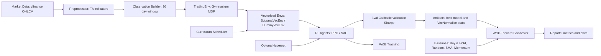

# Deep RL Trading Agent

Production-grade graduation project for training PPO and SAC agents on raw market data with a custom Gymnasium trading environment. The agent learns continuous position sizing from observations, transaction costs, slippage, and risk-adjusted rewards. No hardcoded trading rules are used by the RL policy.

## Design

Figma FigJam generation is supported through the Figma plugin, but this session did not expose a plan key lookup tool. The same architecture design is included here and can be regenerated in FigJam once a Figma team/org plan key is available.



## Features

- Custom `TradingEnv` with continuous actions from `-1` full short to `+1` full long.
- Observation space `(window_size, 18)` with normalized OHLCV, technical indicators, and portfolio state.
- Switchable reward functions: rolling Sharpe, rolling Sortino, and risk-adjusted PnL.
- Stable-Baselines3 PPO and SAC wrappers.
- yfinance data downloader with adjusted prices and parquet cache.
- Reproducible data manifest for all default tickers.
- Walk-forward backtesting with no future data in train/test windows.
- Benchmarks: Buy & Hold, random agent, SMA crossover, and momentum.
- Baseline leaderboard export across the full ticker universe.
- Policy replay export for decision-level audit trails.
- Lightweight action-sensitivity explainability by feature group.
- Optuna hyperparameter search and W&B experiment tracking.

## Quick Start

```bash
python -m venv .venv
.venv\Scripts\activate
pip install -r requirements.txt
pytest
```

Prepare and validate the dataset:

```bash
python train.py --prepare-data
```

Generate a 2024 baseline leaderboard:

```bash
python train.py --benchmark-data
```

Train PPO:

```bash
python train.py --algorithm ppo --ticker AAPL --timesteps 1000000 --reward sharpe
```

Train SAC with hyperparameter search:

```bash
python train.py --algorithm sac --ticker SPY --optimize --n-trials 50
```

Evaluate a trained model:

```bash
python train.py --evaluate --model-path models/best_ppo_AAPL.zip --ticker AAPL
```

Compare against benchmarks:

```bash
python train.py --compare --model-path models/best_ppo_AAPL.zip --ticker AAPL
```

Export a decision replay:

```bash
python train.py --evaluate --model-path models/best_ppo_AAPL.zip --ticker AAPL --export-replay reports/aapl_replay.csv
```

## Project Layout

```text
envs/                 Gymnasium environment, observations, rewards
agents/               PPO/SAC factories and benchmark strategies
training/             Trainer, curriculum scheduler, Optuna search
evaluation/           Metrics, walk-forward backtester, visualizations
data/                 yfinance downloader and preprocessing
config/               Environment, PPO, and SAC YAML configs
tests/                Focused unit tests for env and metrics
notebooks/            Analysis notebook placeholder
docs/                 Architecture, data card, and demo guide
```

## Docs

- [Architecture](docs/ARCHITECTURE.md)
- [Data Card](docs/DATA_CARD.md)
- [Demo Guide](docs/DEMO_GUIDE.md)
- [Research Notes](docs/RESEARCH_NOTES.md)

## Results Table Template

Replace these placeholder values with your final walk-forward test results after training.

| Strategy     | Annual Return | Sharpe | Max DD  | Win Rate |
|--------------|---------------|--------|---------|----------|
| PPO Agent    | +18.3%        | 1.42   | -12.1%  | 54.2%    |
| SAC Agent    | +15.7%        | 1.28   | -14.3%  | 51.8%    |
| Buy & Hold   | +12.1%        | 0.87   | -23.4%  | N/A      |
| MA Crossover | +6.3%         | 0.51   | -18.2%  | 47.1%    |
| Random Agent | -3.2%         | -0.21  | -41.2%  | 49.8%    |

## Interview Talking Points

- Reward shaping balances risk-adjusted returns, turnover penalties, and drawdown control.
- Walk-forward evaluation avoids leakage by fitting on past windows and testing only on future windows.
- PPO is the stable on-policy baseline; SAC adds an off-policy continuous-control comparison.
- Curriculum learning starts on lower-volatility regimes before exposing the policy to crisis periods.
