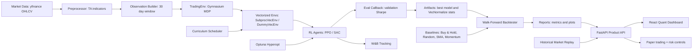
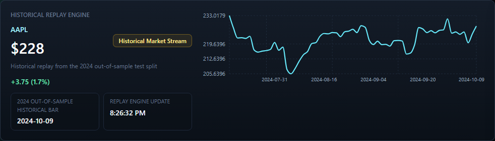
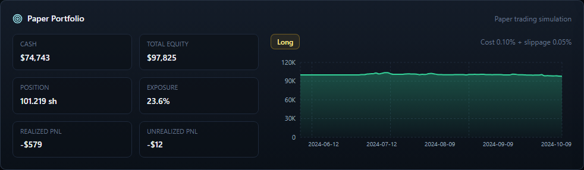
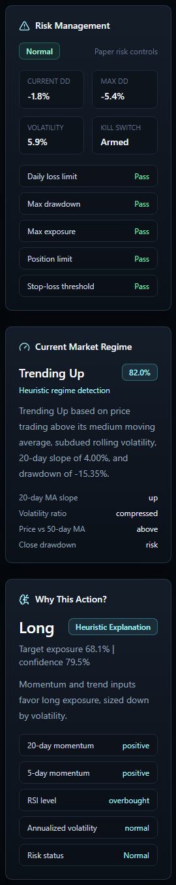
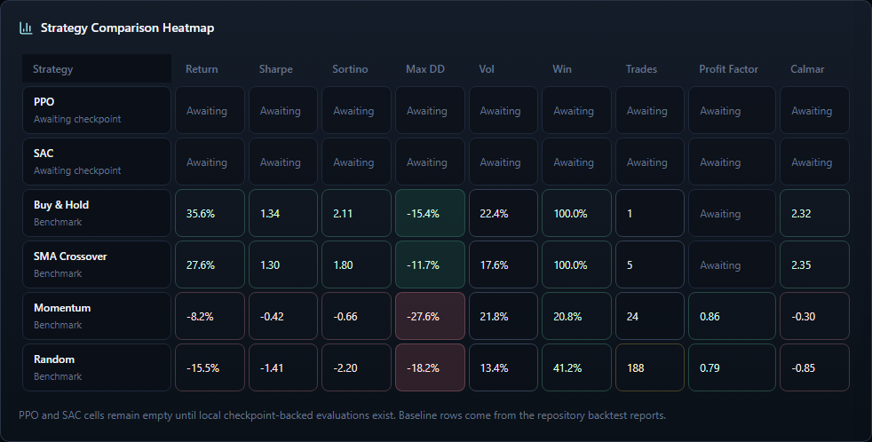
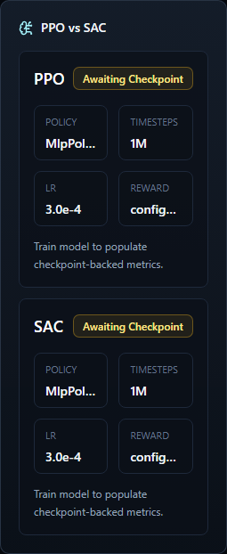
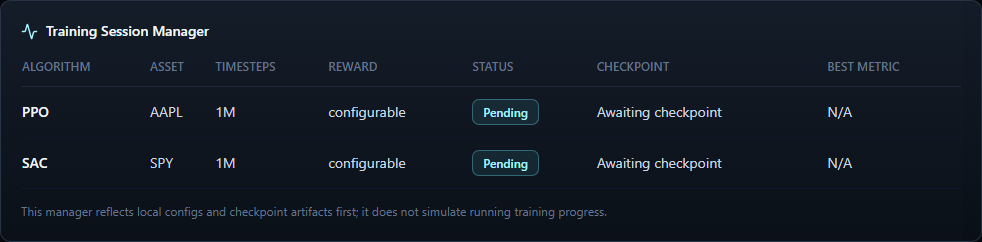

# Deep RL Trading Agent

Deep RL Trading Agent is a production-minded experimentation platform for training PPO and SAC policies on adjusted market data with a custom Gymnasium trading environment. The system learns continuous position sizing from market observations, portfolio state, transaction costs, slippage, and risk-adjusted rewards. No hardcoded trading rules are used by the RL policy.

The project is designed like an applied AI/quant engineering system: reproducible data preparation, leakage-safe feature construction, vectorized RL training, benchmark leaderboards, policy replay, historical market replay, paper trading telemetry, and out-of-sample evaluation are all first-class workflows.

## Design

Figma FigJam generation is supported through the Figma plugin, but this session did not expose a plan key lookup tool. The same architecture design is included here and can be regenerated in FigJam once a Figma team/org plan key is available.



## Features

- Custom `TradingEnv` with continuous actions from `-1` full short to `+1` full long.
- Observation space `(window_size, 18)` with normalized OHLCV, technical indicators, and portfolio state.
- Switchable reward functions: rolling Sharpe, rolling Sortino, and risk-adjusted PnL.
- Stable-Baselines3 PPO and SAC wrappers.
- yfinance data downloader with adjusted prices and parquet cache.
- Reproducible data manifest for all default tickers.
- Walk-forward backtesting with no future data in train/test windows.
- Benchmarks: Buy & Hold, random agent, SMA crossover, and momentum.
- Baseline leaderboard export across the full ticker universe.
- Policy replay export for decision-level audit trails.
- Lightweight action-sensitivity explainability by feature group.
- Optuna hyperparameter search and W&B experiment tracking.
- FastAPI + React product dashboard with WebSocket replay updates.
- Historical Replay Engine that clearly labels 2024 out-of-sample market bars.
- Optional delayed yfinance snapshot mode, labeled separately from historical replay.
- Paper trading engine with cash, exposure, entry price, realized/unrealized PnL, costs, slippage, and no broker execution.
- Risk management panel with drawdown, volatility, exposure limits, stop-loss threshold, risk status, and simulated kill switch.
- Heuristic market regime detection and action explainability when no trained PPO/SAC checkpoint is available.
- Strategy comparison heatmap that keeps PPO/SAC values empty until checkpoint-backed evaluations exist.

## Engineering Safeguards

- Indicator warm-up rows are dropped instead of backward-filled, preventing early observations from receiving future indicator values.
- Chronological train/validation/test splits keep 2024 reserved for final out-of-sample evaluation.
- Walk-forward splits use non-overlapping train/test boundaries.
- Policies trained with `VecNormalize` are evaluated and replayed with saved normalization statistics when `models/vecnormalize.pkl` is present.
- RL trades include transaction costs and slippage; SMA and momentum baselines also pay position-change costs in benchmark reports.
- Training reward is treated as an optimization signal, while final quality is judged with out-of-sample return, Sharpe, drawdown, trade statistics, and benchmark comparisons.
- Dashboard demo mode uses benchmark reports and cached market data; trained PPO/SAC performance appears only after checkpoint artifacts are available.
- WebSocket replay updates are paper/demo telemetry only. The system does not connect to broker APIs and does not route real-money orders.
- Heuristic regime and action-explanation panels are labeled as heuristic when no trained checkpoint is loaded.

## Product Dashboard

The repository includes a FastAPI + React dashboard for a product-grade trading intelligence experience.

Run the API:

```bash
uvicorn backend.main:app --reload
```

Run the frontend:

```bash
cd frontend
npm install
npm run dev
```

Open `http://127.0.0.1:5173`.

<p align="center">
  
</p>

The dashboard includes a Historical Replay Engine, paper portfolio, equity curves, drawdown visualization, risk management guardrails, market regime detection, action explainability, PPO/SAC readiness, training session manager, strategy heatmap, experiment tracking, trade timeline, validation guardrails, and inference demo mode. In demo mode, panels are explicitly based on benchmark reports and local cached data rather than trained model claims.

The product layer is deliberately not a real-money trading system:

- `Historical Market Stream` replays cached 2024 out-of-sample market bars through the dashboard update loop.
- `Delayed Market Snapshot` can be attempted with yfinance by setting `RL_TRADING_FEED_MODE=snapshot`; `RL_TRADING_FEED_MODE=live` is accepted as a compatibility alias but is still labeled as delayed snapshot mode in the UI.
- `Paper trading simulation` applies transaction costs and slippage, tracks exposure and PnL, and blocks additional exposure when risk limits are breached.
- PPO/SAC performance panels show `Awaiting checkpoint` until trained model artifacts and evaluation outputs exist.

## Visual Walkthrough

### Historical Replay Engine

The market panel names the data basis directly: cached 2024 out-of-sample bars replayed through the product event loop. It does not present historical data as current-market streaming.

<p align="center">
  
</p>

### Paper Portfolio

The paper portfolio shows cash, position, exposure, realized/unrealized PnL, total equity, costs, slippage, and simulated fills. It never implies broker execution.

<p align="center">
  
</p>

### Risk And Regime

Risk guardrails, regime detection, and action explanation are displayed as engineering controls and heuristic diagnostics, not profitability claims.

<p align="center">
  
</p>

### Strategy Comparison Heatmap

PPO and SAC remain `Awaiting checkpoint` until real checkpoint-backed evaluations are available; baseline rows come from generated reports.

<p align="center">
  
</p>

### PPO vs SAC

The model comparison panel surfaces checkpoint readiness without inventing policy performance.

<p align="center">
  
</p>

### Training Session Manager

Training sessions are derived from local configs and checkpoint artifacts; the dashboard does not simulate running training progress.

<p align="center">
  
</p>


## Quick Start

```bash
python -m venv .venv
.venv\Scripts\activate
pip install -r requirements.txt
pytest
```

Prepare and validate the dataset:

```bash
python train.py --prepare-data
```

Generate a 2024 baseline leaderboard:

```bash
python train.py --benchmark-data
```

Train PPO:

```bash
python train.py --algorithm ppo --ticker AAPL --timesteps 1000000 --reward sharpe
```

Train SAC with hyperparameter search:

```bash
python train.py --algorithm sac --ticker SPY --optimize --n-trials 50
```

Evaluate a trained model:

```bash
python train.py --evaluate --model-path models/best_ppo_AAPL.zip --ticker AAPL
```

Compare against benchmarks:

```bash
python train.py --compare --model-path models/best_ppo_AAPL.zip --ticker AAPL
```

Export a decision replay:

```bash
python train.py --evaluate --model-path models/best_ppo_AAPL.zip --ticker AAPL --export-replay reports/aapl_replay.csv
```

## Project Layout

```text
envs/                 Gymnasium environment, observations, rewards
agents/               PPO/SAC factories and benchmark strategies
training/             Trainer, curriculum scheduler, Optuna search
evaluation/           Metrics, walk-forward backtester, visualizations
data/                 yfinance downloader and preprocessing
config/               Environment, PPO, and SAC YAML configs
tests/                Focused unit tests for env and metrics
notebooks/            Analysis notebook placeholder
docs/                 Architecture, data card, and demo guide
```

## Docs

- [Architecture](docs/ARCHITECTURE.md)
- [Data Card](docs/DATA_CARD.md)
- [Evaluation Methodology](docs/EVALUATION.md)
- [Product Dashboard](docs/DASHBOARD.md)
- [Demo Guide](docs/DEMO_GUIDE.md)

## Results Workflow

Use the generated baseline and evaluation reports as the source of truth for model claims. A trained PPO/SAC run should be reported only after it is evaluated out-of-sample and compared against simple baselines after costs.

| Strategy     | Annual Return | Sharpe | Max DD  | Win Rate |
|--------------|---------------|--------|---------|----------|
| PPO Agent    | Run evaluation | From report | From report | From report |
| SAC Agent    | Run evaluation | From report | From report | From report |
| Buy & Hold   | `reports/baseline_benchmarks.csv` | From report | From report | From report |
| SMA Crossover | `reports/baseline_benchmarks.csv` | From report | From report | From report |
| Random Agent | `reports/baseline_benchmarks.csv` | From report | From report | From report |

## Engineering Talking Points

- Reward shaping balances risk-adjusted returns, turnover penalties, and drawdown control without using handcrafted entry/exit rules.
- Evaluation avoids leakage by fitting on past windows and testing only on future windows.
- PPO provides a stable on-policy baseline; SAC adds an off-policy continuous-control comparison.
- Curriculum learning can start on lower-volatility regimes before exposing the policy to broader market stress.
- Replay exports make policy behavior inspectable at the decision level, which helps debug failure modes before trusting aggregate metrics.
