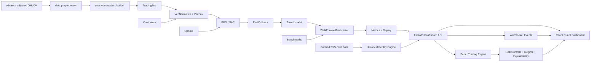

# Architecture

This project is organized as an applied RL systems stack: data ingestion, leakage-safe feature construction, environment simulation, vectorized policy optimization, artifact management, out-of-sample evaluation, and a product dashboard for paper trading intelligence.



## Design Choices

- `TradingEnv` exposes a continuous target exposure action, which lets PPO and SAC learn position sizing instead of selecting from a tiny discrete menu.
- Observations include only current and past data. Rolling indicators are computed forward in time and backtesting uses walk-forward splits to avoid future leakage.
- Rewards are switchable so experiments can compare raw risk-adjusted PnL against Sharpe and Sortino shaping.
- Evaluation is separated from training. Backtesting, metrics, replay, and visualization live under `evaluation/` so the training code does not become a reporting script.
- Policies trained with `VecNormalize` are evaluated and replayed with saved normalization statistics when `models/vecnormalize.pkl` is present.

## System Safeguards

- Data preprocessing drops indicator warm-up rows instead of backward-filling them.
- Feature normalization is windowed or derived from current/past values, while SB3 `VecNormalize` statistics are saved as model artifacts.
- Trading frictions are part of the environment, not a reporting afterthought.
- Baseline strategies are evaluated through the same metrics layer as RL agents.
- Replay exports provide a decision-level audit trail with action, position, return, reward, drawdown, and costs.
- The product dashboard distinguishes benchmark/demo telemetry from checkpoint-backed model inference.
- Paper trading telemetry is explicitly separated from broker execution. There is no real-money order routing or broker API adapter in the current system.
- Market update panels are labeled by source mode: historical market stream, delayed market snapshot, or cached demo mode.
- PPO/SAC dashboard cells stay empty until checkpoint-backed evaluations are available.

## Reward Layer

The environment supports three reward modes:

- `sharpe`: rolling 30-step Sharpe, clipped to avoid unstable reward explosions.
- `sortino`: downside-risk-adjusted reward for policies that should be less sensitive to upside volatility.
- `pnl`: step return with turnover and drawdown penalties for direct portfolio optimization.

These rewards are optimization signals. Production-style evaluation still comes from out-of-sample equity curves, risk metrics, benchmark comparison, and replay inspection.

## Product Surface

The FastAPI + React dashboard is a deployment-oriented view over the ML system:

- local API endpoints expose cached data, benchmark leaderboards, model readiness, historical replay telemetry, and dashboard state
- a WebSocket replay endpoint emits `MARKET_REPLAY_UPDATE`, `PAPER_TRADE_UPDATE`, `RISK_UPDATE`, `REGIME_UPDATE`, `AGENT_SIGNAL`, and `EXPERIMENT_UPDATE` events
- the paper trading engine simulates cash, position, exposure, entry price, realized/unrealized PnL, transaction costs, slippage, equity curve, and trade history
- the risk layer monitors current drawdown, maximum drawdown, volatility, daily loss limit, max exposure, position limit, stop-loss threshold, rule violations, and simulated kill-switch state
- heuristic regime detection uses moving-average slope, return volatility, price-vs-moving-average behavior, and drawdown context
- action explainability summarizes momentum, RSI, volatility, risk status, and confidence when checkpoint inference is unavailable
- the frontend visualizes equity curves, drawdowns, model status, experiment readiness, benchmark tables, strategy heatmap, training sessions, paper trades, and inference replay
- no trained PPO/SAC performance is shown until checkpoint artifacts exist
- demo-mode panels are labeled as benchmark or awaiting-telemetry surfaces

## Market Replay Telemetry

`backend/quant_product.py` owns the historical replay product state. The default implementation uses cached 2024 out-of-sample test-period bars as a `Historical Market Stream`. This gives the dashboard event-driven update semantics without implying current market streaming.

An opt-in yfinance delayed snapshot path is available with `RL_TRADING_FEED_MODE=snapshot`; if it cannot fetch data, the product remains safe to run in historical replay mode.

The primary transport is:

```text
GET /api/dashboard?ticker=AAPL
GET /api/replay/AAPL?cursor=80
WS  /ws/replay/AAPL
```

The frontend subscribes to the replay WebSocket and updates panels without a full page refresh. If the socket is unavailable, the documented fallback is polling the dashboard or replay endpoints. The fallback should remain visibly labeled as historical replay or cached telemetry.

## Future Deployment Placeholder

A production deployment plan would add authentication, durable experiment storage, market-data provider credentials, model artifact registry, observability, and explicit broker-adapter boundaries. That work is intentionally out of scope for the current implementation, and the current system remains paper/demo only.

## Extension Points

- Add more reward functions in `envs/reward_functions.py`.
- Add new benchmarks in `agents/baselines.py`.
- Add experiment callbacks in `training/trainer.py`.
- Add report outputs in `evaluation/replay.py` and `evaluation/visualizer.py`.
- Add a production market-data provider behind the market feed interface while preserving explicit source-mode labels.
