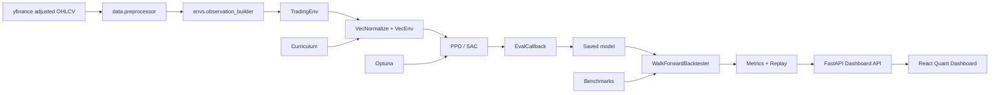

# Architecture

This project is organized as an applied RL systems stack: data ingestion, leakage-safe feature construction, environment simulation, vectorized policy optimization, artifact management, and out-of-sample evaluation.

## Design Choices

- `TradingEnv` exposes a continuous target exposure action, which lets PPO and SAC learn position sizing instead of selecting from a tiny discrete menu.
- Observations include only current and past data. Rolling indicators are computed forward in time and backtesting uses walk-forward splits to avoid future leakage.
- Rewards are switchable so experiments can compare raw risk-adjusted PnL against Sharpe and Sortino shaping.
- Evaluation is separated from training. Backtesting, metrics, replay, and visualization live under `evaluation/` so the training code does not become a reporting script.
- Policies trained with `VecNormalize` are evaluated and replayed with saved normalization statistics when `models/vecnormalize.pkl` is present.

## System Safeguards

- Data preprocessing drops indicator warm-up rows instead of backward-filling them.
- Feature normalization is windowed or derived from current/past values, while SB3 `VecNormalize` statistics are saved as model artifacts.
- Trading frictions are part of the environment, not a reporting afterthought.
- Baseline strategies are evaluated through the same metrics layer as RL agents.
- Replay exports provide a decision-level audit trail with action, position, return, reward, drawdown, and costs.
- The product dashboard distinguishes benchmark/demo telemetry from checkpoint-backed model inference.

## Reward Layer

The environment supports three reward modes:

- `sharpe`: rolling 30-step Sharpe, clipped to avoid unstable reward explosions.
- `sortino`: downside-risk-adjusted reward for policies that should be less sensitive to upside volatility.
- `pnl`: step return with turnover and drawdown penalties for direct portfolio optimization.

These rewards are optimization signals. Production-style evaluation still comes from out-of-sample equity curves, risk metrics, benchmark comparison, and replay inspection.

## Product Surface

The FastAPI + React dashboard is a deployment-oriented view over the ML system:

- local API endpoints expose cached data, benchmark leaderboards, model readiness, and dashboard telemetry
- the frontend visualizes equity curves, drawdowns, model status, experiment readiness, benchmark tables, and inference replay
- no trained PPO/SAC performance is shown until checkpoint artifacts exist
- demo-mode panels are labeled as benchmark or awaiting-telemetry surfaces

## Extension Points

- Add more reward functions in `envs/reward_functions.py`.
- Add new benchmarks in `agents/baselines.py`.
- Add experiment callbacks in `training/trainer.py`.
- Add report outputs in `evaluation/replay.py` and `evaluation/visualizer.py`.
