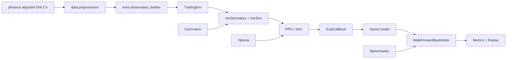

# Architecture

This project is organized around a clean RL research loop: data ingestion, feature construction, environment simulation, policy optimization, and leakage-aware evaluation.

## Design Choices

- `TradingEnv` exposes a continuous target exposure action, which lets PPO and SAC learn position sizing instead of selecting from a tiny discrete menu.
- Observations include only current and past data. Rolling indicators are computed forward in time and backtesting uses walk-forward splits to avoid future leakage.
- Rewards are switchable so experiments can compare raw risk-adjusted PnL against Sharpe and Sortino shaping.
- Evaluation is separated from training. Backtesting, metrics, replay, and visualization live under `evaluation/` so the training code does not become a reporting script.
- Policies trained with `VecNormalize` are evaluated and replayed with saved normalization statistics when `models/vecnormalize.pkl` is present.

## Extension Points

- Add more reward functions in `envs/reward_functions.py`.
- Add new benchmarks in `agents/baselines.py`.
- Add experiment callbacks in `training/trainer.py`.
- Add report outputs in `evaluation/replay.py` and `evaluation/visualizer.py`.
